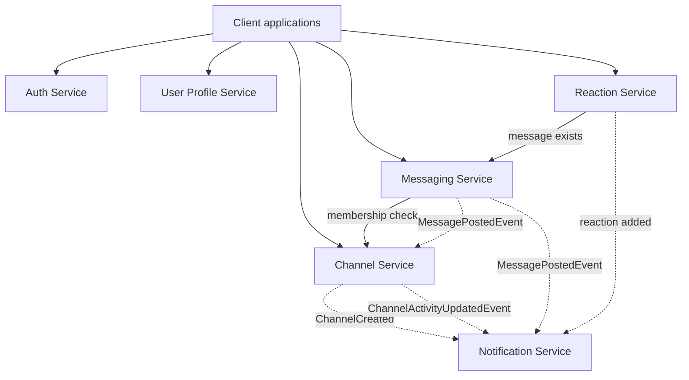
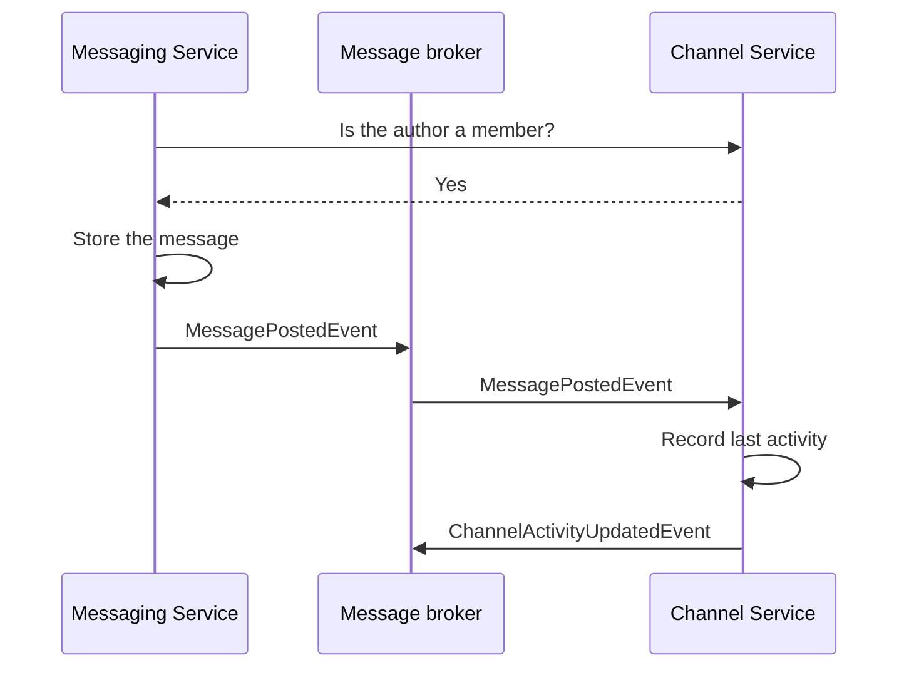

# Interactions

## Two kinds of communication

Services communicate in two ways, and the choice depends on whether the caller needs an answer.

**Direct calls over HTTP.** The caller waits for a reply. Used when the answer is needed to continue — for example, the Messaging Service asking whether a user may write in a channel. The caller must handle the callee being slow or unavailable.

**Events through a message broker.** The publisher does not wait and does not know who is listening. Used to announce that something has happened. A slow consumer never blocks the publisher.

## System overview

Solid arrows are direct calls where the caller waits for a reply. Dashed arrows are events through the broker.

## Events this service publishes

| Event | Published when | Fields |
| --- | --- | --- |
| `ChannelCreated` | A channel is created | `ChannelId`, `Name` |
| `ChannelActivityUpdatedEvent` | A message is posted in a known channel | `MessageId`, `ChannelId`, `LastActivityAt`, `ProcessedAt` |

## Events this service consumes

| Event | Published by | What this service does |
| --- | --- | --- |
| `MessagePostedEvent` | Messaging Service | Records the channel's last activity and publishes `ChannelActivityUpdatedEvent` |

Both tables list one event per row. "Fields" names what travels with the event; `MessageId` is carried through so a message can be traced across services.

## Flow: a message is posted

The membership check is a direct call, because the Messaging Service cannot accept the message without an answer. Everything after the message is stored is asynchronous.

## What is implemented

The Channel Service currently exposes `/channels` with create, read, update and delete, publishes `ChannelCreated` and `ChannelActivityUpdatedEvent`, and consumes `MessagePostedEvent`.

The membership check drawn above is part of the design but has no endpoint yet. The domain model carries membership and roles, so the data is there; what is missing is a read endpoint for other services to ask against, along the lines of `GET /channels/{id}/members/{userId}`. Until it exists, no other service can perform that check.

## Contracts

Event definitions live in a shared project, so a field that one service removes will fail to compile in the others. That catches the shape of a message, not its values: a field can be present and still be empty. Contract tests cover the values — the provider asserts what it publishes, the consumer asserts what it needs. This service holds the consumer side for `MessagePostedEvent`.

### Where the shared project lives

In a monorepo the shared project would sit at `packages/Shared.Contracts`, next to the services, and every service would reference the same files. Each service here has its own repository, so `src/Shared.Contracts` is a local copy of that project rather than the shared one.

That weakens the guarantee. Two services can hold definitions of the same event that differ without anyone noticing until a message fails to deserialize at runtime. The compile-time check only works within one repository.

Note that `Shared.Contracts` and `ChannelService.Shared` are two different things. `Shared.Contracts` holds events the whole system exchanges. `ChannelService.Shared` holds `ChannelDto`, which is this service's own contract for its REST API.